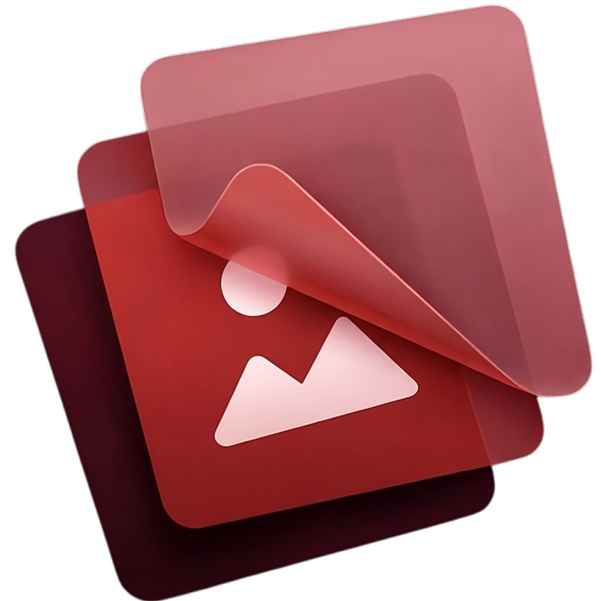
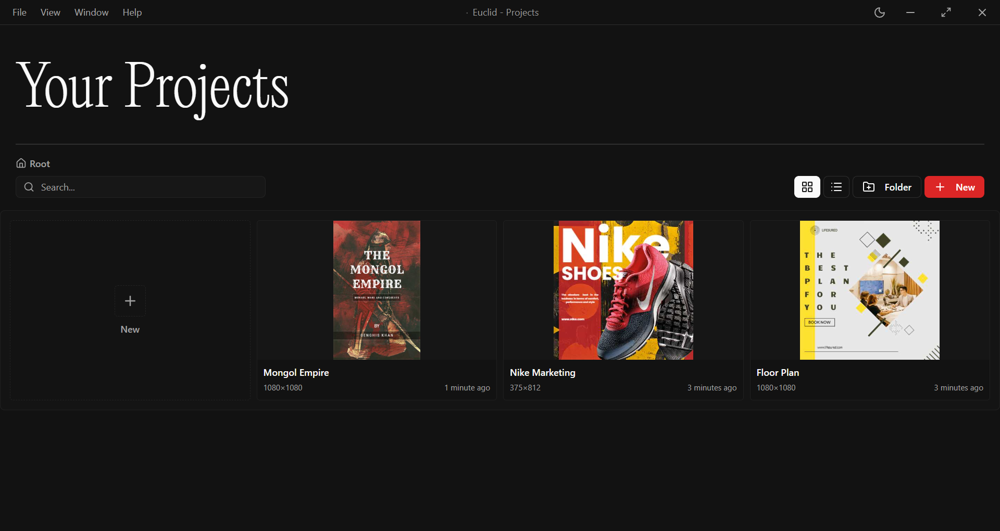
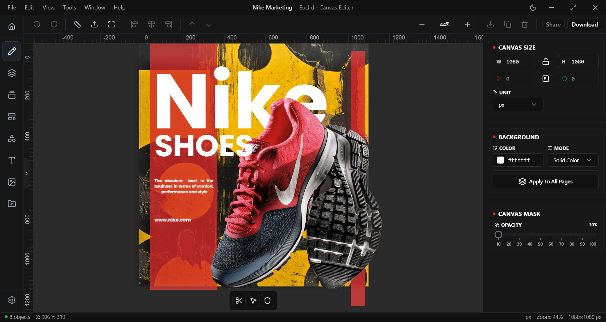
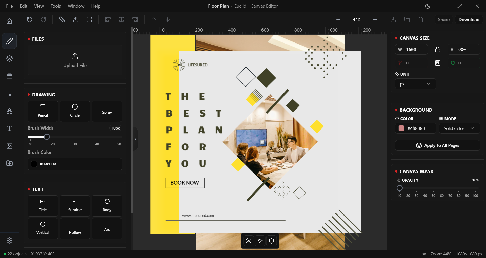

<p align="center">
  
</p>

<h1 align="center">Euclid</h1>

<p align="center">
  <em>A modern, cross-platform <strong>design &amp; editing desktop application</strong> built with Electron, Vue 3, and fabric.js.</em>
</p>

<p align="center">
  <a href="https://github.com/ArivAfonso/euclid"></a>
  <a href="https://github.com/ArivAfonso/euclid/blob/main/LICENSE"></a>
  <br />
  
  
  
  
  
  
  
</p>

Euclid is a full-featured visual editor that lets you create designs from a rich library of built-in templates, manipulate them on a canvas, and export your work — all in a fast, native desktop shell. It ships as a **monorepo** containing a desktop app (Electron) and a serverless API (Cloudflare Workers) that powers stock-image and font search.

---

## ✨ Features

- 🖼️ **Template library** — dozens of ready-made templates (weddings, business cards, food, fashion, books, and more) with live previews.
- 🎨 **Canvas editor** — full design editing powered by **fabric.js** with selection, guides, rulers, distance guides, hover borders, history (undo/redo), and touch support.
- 🧩 **Projects workspace** — create, organize, and reopen your designs.
- 🔍 **Stock image & font search** — search CC0 images (Unsplash, Pixabay, Flickr) and Google Fonts via the bundled Cloudflare Workers API.
- 🌗 **Dark / light mode** — automatic OS theme detection with a polished UI (Tailwind CSS + shadcn-style components).
- 🔄 **Auto-updates** — background update checks with in-app download & restart prompts (via `electron-updater` + GitHub releases).
- 🖥️ **Cross-platform** — Windows (NSIS), macOS (DMG), and Linux (AppImage) installers.

---

## 📸 Screenshots

### Projects

<!-- Add screenshot: apps/desktop/public/img/previews/home.png -->
<p align="center">
  
</p>

### Canvas Editor

<!-- Add screenshot: apps/desktop/public/img/previews/editor.png -->
<p align="center">
  
</p>

### Workspace Controls

<!-- Add screenshot: apps/desktop/public/img/previews/projects.png -->
<p align="center">
  
</p>

---

## 🧱 Tech Stack

| Layer      | Technology                                                        |
| ---------- | ----------------------------------------------------------------- |
| Desktop    | Electron 28, electron-vite, electron-builder, electron-updater    |
| Frontend   | Vue 3, TypeScript, Vue Router, Pinia                              |
| Canvas     | fabric.js                                                         |
| Styling    | Tailwind CSS, SCSS, shadcn-style Vue components                   |
| Backend    | Cloudflare Workers, Hono, chanfana, zod                           |
| Tooling    | Turborepo, npm workspaces, ESLint                                 |


---

## 🚀 Getting Started (Development)

### Prerequisites

- **Node.js** `>= 18.0.0` (the repo pins `18.19.0` via Volta)
- **npm** `>= 8.0.0`
- **Git**

### 1. Install dependencies

```bash
git clone https://github.com/ArivAfonso/euclid.git
cd euclid
npm install
```

### 2. Configure the API (optional)

The desktop app talks to the Cloudflare Workers API for stock images and fonts. Copy the example env file and point it at your deployed worker (or use the local dev server):

```bash
cd apps/desktop
copy .env.example .env
```

```env
VITE_CF_WORKERS_API=https://stock-image-api.your-domain.workers.dev
# VITE_CF_WORKERS_API=http://localhost:8787   # for local dev
```

### 3. Run in development

From the repo root:

```bash
# Desktop app only
npm run dev:desktop

# Desktop app + local API server
npm run dev:with-server

# Everything (all workspaces)
npm run dev
```

The Electron window will open automatically. The renderer dev server runs on port `5173` (Electron) / `5174` (web).

---

## 🏗️ Building the App

### Desktop installers

```bash
# All platforms
npm run build:desktop

# Or platform-specific (from apps/desktop)
cd apps/desktop
npm run build:win     # Windows NSIS installer
npm run build:mac     # macOS DMG
npm run build:linux   # Linux AppImage
```

Installers are written to `apps/desktop/release/<version>/`.

### Web build (renderer only)

```bash
cd apps/desktop
npm run build:web
```

### Server (Cloudflare Workers)

```bash
cd apps/server
npm run dev       # local dev (wrangler)
npm run deploy    # deploy to Cloudflare
```

---

## ⚠️ Installing the App (Unsigned Build)

> **Important:** The current build is **NOT code-signed**. This means Windows will show security warnings during installation and on first launch. This is expected and safe for a build you compiled yourself or downloaded from a trusted source. The steps below walk you through it precisely.

### Windows (NSIS installer)

1. **Locate the installer** — after a successful build, find the `.exe` installer in:
   ```
   apps/desktop/release/<version>/Euclid Setup <version>.exe
   ```
   (e.g. `apps/desktop/release/0.1.0/Euclid Setup 0.1.0.exe`)

2. **Run the installer** — double-click the `.exe`. Because the app is unsigned, **Windows SmartScreen** will likely appear:

   > **Windows protected your PC**
   > *Microsoft Defender SmartScreen prevented an unrecognized app from starting.*

   - Click **More info** (a link in the dialog).
   - Click **Run anyway**.

3. **User Account Control (UAC) prompt** — the installer requests administrator privileges (the NSIS config uses `perMachine: true`). Click **Yes** when prompted.

4. **Follow the installer wizard** — since `oneClick` is disabled, you get a full wizard:
   - Choose the **installation directory** (you can change it — `allowToChangeInstallationDirectory` is enabled).
   - Confirm the **Start Menu** shortcut and **Desktop** shortcut creation.
   - Click **Install** and wait for it to finish.
   - The app launches automatically when installation completes (`runAfterFinish: true`).

5. **First launch** — if Windows shows another SmartScreen prompt when you first open Euclid, click **More info → Run anyway** again. This only happens because the executable isn't signed.

### macOS (DMG)

1. Open the `.dmg` from `apps/desktop/release/<version>/`.
2. Drag the **Euclid** app into the **Applications** folder.
3. On first launch, macOS Gatekeeper will block the unsigned app:
   - **Right-click** the app in Finder → select **Open**.
   - Click **Open** in the confirmation dialog.
   - (Alternatively: **System Settings → Privacy & Security → Open Anyway**.)

### Linux (AppImage)

1. Make the AppImage executable:
   ```bash
   chmod +x "Euclid <version>.AppImage"
   ```
2. Run it:
   ```bash
   ./Euclid <version>.AppImage
   ```
3. If your distro blocks it, add the `--no-sandbox` flag or mark it trusted in your file manager.

---

## 🔄 Auto-Updates

Euclid uses `electron-updater` with the **GitHub provider**:

- On startup the app silently checks for new releases.
- If an update is found, a toast appears: *"Euclid vX.Y.Z is available — Download"*.
- Click **Download** to see progress, then **Restart Now** to install and relaunch.

> **Note:** Because the app is unsigned, the auto-update installer will also trigger the same SmartScreen / UAC prompts described above. Click **More info → Run anyway** and **Yes** to proceed.

---

## 🧪 Useful Scripts

| Command                  | Description                                  |
| ------------------------ | -------------------------------------------- |
| `npm run dev`            | Run all workspaces in dev mode               |
| `npm run dev:desktop`    | Run the desktop app only                     |
| `npm run dev:server`     | Run the API server only                      |
| `npm run build`          | Build all workspaces                         |
| `npm run build:desktop`  | Build the desktop app + installers           |
| `npm run lint`           | Lint all workspaces                          |
| `npm run type-check`     | Type-check all workspaces                    |
| `npm run clean`          | Clean build artifacts                        |

---

## 📄 License

This project is licensed under the terms included in `apps/desktop/build/license.txt`.

---

*Built with ❤️ using Electron, Vue 3, and fabric.js.*
